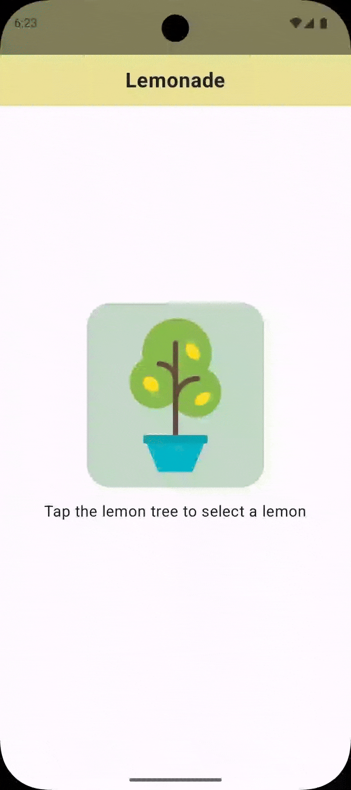

# 🍋 Lemonade App

The **Lemonade App** is a simple mobile app built with **Kotlin** and **Jetpack Compose**. This app simulates a lemonade-making process, where users follow the steps of making lemonade, from squeezing lemons to serving the drink. 🍹

## ⚡ Features 

- **Interactive Process**: Step-by-step lemonade making simulation.
- **Colorful UI**: A vibrant, user-friendly interface built with Jetpack Compose. 

## 📸 GIFs



## 🛠️ Installation 

To run this app, follow these steps:

1. Clone this repository:
    ```bash
    git clone https://github.com/RishantBana/lemonade-app.git
    ```

2. Open the project in **Android Studio**. 

3. Make sure you have the latest version of **Kotlin** and **Jetpack Compose**. 

4. Run the project on an emulator or a physical device. 

## 🖥️ Tech Stack 

- **Kotlin**: The primary language for building the app. 
- **Jetpack Compose**: A modern toolkit for building native UIs. 
- **Android Studio**: The IDE for Android development. 

---
